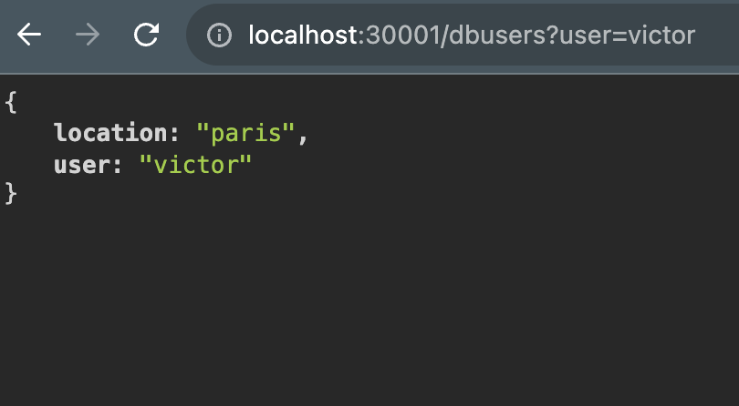

# Simple Dockerised Flask Application ready for k8s deployment.

## A Simple Python User Application with Flask.
By default, the app listens on 5001 of the container bound to the user machine on the same.

While running this image on K8s, there would be need to export the POSTGRES_PASSWORD variable as a K8s secret. The App would then run on 30001 of the user machine

To use this application,

**Stand-Alone :**  
-------------------
Run `docker pull viciwuoha/py-docker-cicd:latest`   OR    `docker pull viciwuoha/py-docker-cicd:multi` to get the arm64 specific build..

**To run on k8s (with k8s already installed/on docker) :** 
-----------------

1) Simply create a secret named db-passwd pointing to a POSTGRES_PASSWORD variable.

eg; `kubectl create secret generic db-passwd --from-file=POSTGRES_PASSWORD=db/kpass.txt` , where the file at `db/kpass.txt` contains a key as follows; POSTRES_PASSWORD=xyourpasswordofchoice

2) run the deployment using 
  `kubectl apply -f dc-py-kube-config.yaml`

_The default port 5000 was changed Simply because Mac has a known ussue with this port._

## **Application Preview after API Endpoint Call**

